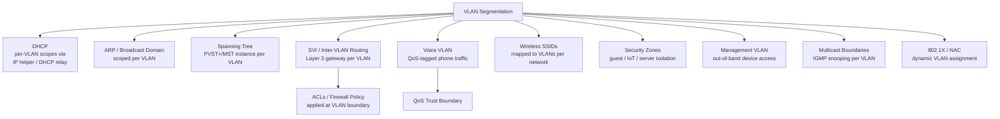

## What is a VLAN?

A VLAN (Virtual LAN) is a logical broadcast domain created inside one or more physical switches. Ports assigned to the same VLAN behave as if they were on their own isolated switch, even though they may be spread across many physical switches — and ports in different VLANs cannot communicate without a Layer 3 device (a router or a switch's routing engine) forwarding between them.

Frames carry their VLAN membership as they cross trunk links using 802.1Q tagging — a 4-byte tag inserted into the Ethernet header that includes the VLAN ID (12 bits, 1–4094) and a priority field (802.1p, 3 bits, used for QoS).

## Why VLANs are needed

- **Broadcast domain control** — Without VLANs, every device on a physical switch fabric shares one broadcast domain. ARP requests, DHCP discovers, and other broadcast/multicast traffic reach every port, which doesn't scale and wastes bandwidth. VLANs split a large flat network into smaller domains.
- **Traffic isolation and security** — Separating servers, users, guest Wi-Fi, IoT devices, and management traffic into different VLANs limits the blast radius of a compromised host and enforces segmentation policy via Layer 3 ACLs/firewalls at the inter-VLAN boundary.
- **Logical grouping independent of physical location** — Devices on different floors or switches can belong to the same VLAN (e.g., all of Finance's PCs), and devices plugged into the same switch can belong to different VLANs. Physical topology no longer dictates network topology.
- **Reduced cost** — One physical switch fabric can serve many logically separate networks, avoiding the need for dedicated switches per department or function.
- **Enabling policy at the network edge** — QoS, ACLs, and DHCP scopes are commonly applied per-VLAN, so segmenting traffic by VLAN is what makes those policies practical to manage.

## Services that depend on VLANs

Many services either require a VLAN boundary to function correctly or use VLAN segmentation as their primary means of isolation.



- **DHCP** — Scopes are almost always defined per-subnet, and a subnet is almost always tied to a VLAN. Routers/switches relay DHCP requests (`ip helper-address` / `ip dhcp relay`) from client VLANs to a central DHCP server.
- **ARP and broadcast traffic** — ARP requests are broadcast, and broadcasts don't cross VLAN boundaries; this is the core mechanism that keeps broadcast domains small.
- **Spanning Tree Protocol** — PVST+/Rapid-PVST+ run one STP instance per VLAN; MST maps VLANs to a smaller number of instances. Either way, loop prevention is computed per VLAN topology.
- **Inter-VLAN routing (SVIs / router-on-a-stick)** — A Layer 3 gateway (Switched Virtual Interface or subinterface) is required for any two VLANs to talk to each other.
- **Voice VLANs** — IP phones are placed in a separate voice VLAN from the attached PC to apply QoS trust and prioritize voice traffic without needing a separate physical switch port.
- **Wireless LAN controllers/APs** — SSIDs are commonly mapped 1:1 to VLANs, so wireless traffic inherits the same segmentation as wired.
- **Security zones (guest, IoT, servers, DMZ)** — Firewalls and ACLs are applied at the VLAN's Layer 3 boundary, so the VLAN is the enforcement unit.
- **Out-of-band management** — A dedicated management VLAN keeps device administration (SSH, SNMP) separate from user traffic.
- **Multicast (IGMP snooping)** — Snooping tables and multicast forwarding boundaries are maintained per VLAN.
- **802.1X / Network Access Control** — RADIUS servers can dynamically assign a VLAN to a port/user at authentication time (e.g., quarantine VLAN for failed posture checks).

## Standard VLAN constraints (IEEE 802.1Q)

- **VLAN ID range**: 12-bit field → 0–4095, but 0 and 4095 are reserved, so **1–4094** are usable. VLAN 1 is the default VLAN on most switches and typically can't be deleted (behavior varies by vendor).
- **Native VLAN**: One VLAN per trunk is untagged (the "native" VLAN). Frames in the native VLAN cross the trunk without an 802.1Q tag. Mismatched native VLANs on either end of a trunk are a common misconfiguration that leaks traffic between VLANs.
- **Broadcast domain = VLAN**: A VLAN is exactly one broadcast domain; extending a VLAN across sites/switches requires trunking (802.1Q) or an overlay (e.g., VXLAN) between them.
- **One VLAN per subnet, conventionally**: Not a hard protocol requirement, but the near-universal design pattern — routers assume this when doing inter-VLAN routing.
- **MTU/tag overhead**: The 802.1Q tag adds 4 bytes to the Ethernet frame (802.1ad Q-in-Q adds another 4). This can push frames over 1518 bytes, so tagged-frame support (baby giant) must be accounted for end to end.
- **Trunk encapsulation**: Only 802.1Q is an open standard today; Cisco's older ISL encapsulation is proprietary and deprecated.

## Cisco IOS-XE VLAN constraints

- **VLAN ranges**:
  - **Normal range**: 1–1005, stored in `vlan.dat` (VTP-synchronized when VTP is in server/client mode).
  - **Extended range**: 1006–4094, stored only in the running-config, not synchronized by VTP versions 1/2 (VTP version 3 does support extended-range VLANs).
- **Reserved/default VLANs**: 1002–1005 are reserved for legacy FDDI/Token Ring and cannot be deleted or used for Ethernet. VLAN 1 is the default Ethernet VLAN and default native VLAN; it cannot be deleted, though it can (and often should) be pruned from trunks and unused access ports for security.
- **VTP (VLAN Trunking Protocol)**: In VTP server/client mode (v1/v2), VLAN configuration is pushed domain-wide, which limits normal-range VLANs to 1005 and requires matching domain name/password/revision awareness. VTP transparent mode (or VTP off/v3) is recommended in modern designs to avoid the classic "higher revision number wipes the domain's VLAN database" incident.
- **Per-VLAN Spanning Tree**: PVST+/Rapid-PVST+ consumes one STP instance per active VLAN; platforms have a maximum number of concurrent STP instances (varies by platform, often 128–255), which becomes a practical ceiling on active VLANs when using PVST rather than MST.
- **SVI scaling**: Each VLAN with a Layer 3 gateway needs an SVI; platform-specific maximums on SVI count and hardware routing table (CAM/TCAM) size apply on switches doing hardware-based inter-VLAN routing.
- **Voice VLAN**: Configured per access port (`switchport voice vlan <id>`) — a port supports at most one data VLAN and one voice VLAN simultaneously.

## Cisco NX-OS VLAN constraints

- **VLAN range**: 1–3967 are usable for normal configuration; **3968–4047** and **4094** are reserved for internal/system use (e.g., internally allocated VLANs for features like FabricPath or multicast); the exact internal reservation can shift slightly by platform/NX-OS release, so `show vlan internal usage` should be checked on the box.
- **No VTP by default in modern designs**: VTP exists on NX-OS but is far less commonly deployed than on IOS-XE; most NX-OS/Nexus fabrics (especially in VXLAN/EVPN or vPC designs) manage VLANs via local config or automation rather than VTP.
- **vPC (Virtual Port Channel) consistency**: In a vPC domain, VLANs allowed on the vPC peer-link and member port-channels must match between the two peer switches — a VLAN mismatch is flagged as a type-1 (or type-2, depending on release) consistency check failure and can suspend the vPC.
- **VLAN and VNI mapping (VXLAN/EVPN)**: On Nexus fabrics running VXLAN, each VLAN is mapped to a 24-bit VXLAN Network Identifier (VNI), which vastly extends the effective segment count beyond the 12-bit 802.1Q limit — but the classic VLAN (1–3967 usable) still applies at the access-facing, non-VXLAN edge.
- **SVI and interface-vlan scaling**: NX-OS platforms have their own maximum counts for `interface vlan` (SVI) instances and for VLANs active in hardware forwarding tables, which are platform/ASIC dependent (verify with the specific model's configuration limits guide).
- **Storm control and STP defaults**: NX-OS defaults to Rapid PVST+ like IOS-XE but is commonly deployed with MST or with STP disabled entirely in pure Layer 3/VXLAN leaf-spine fabrics, since VLANs may not need to span multiple switches at all in that design.

## Verification commands

```text
! IOS-XE
show vlan brief
show vlan id 100
show interfaces trunk
show spanning-tree vlan 100
show vtp status

! NX-OS
show vlan brief
show vlan internal usage
show interface trunk
show spanning-tree vlan 100
show vpc consistency-parameters vlans
show nve vni          ! VXLAN VLAN-to-VNI mapping
```
